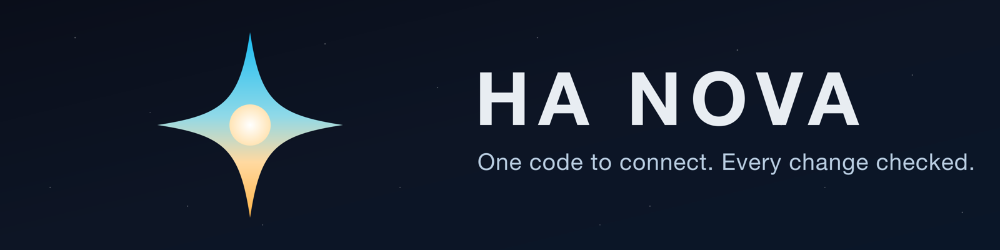
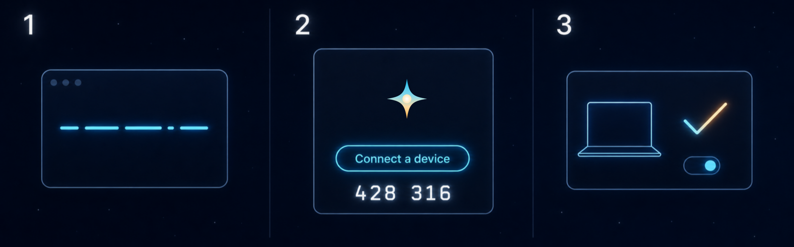
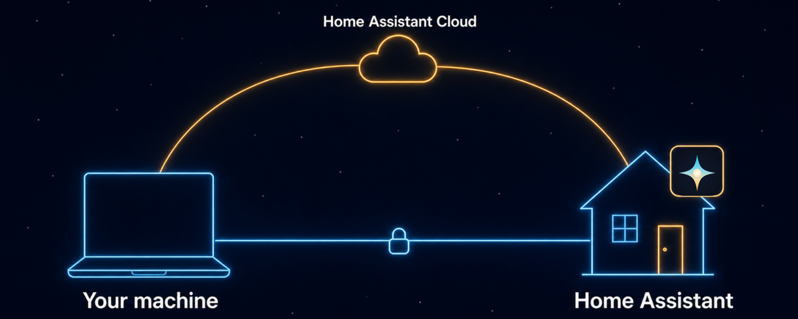
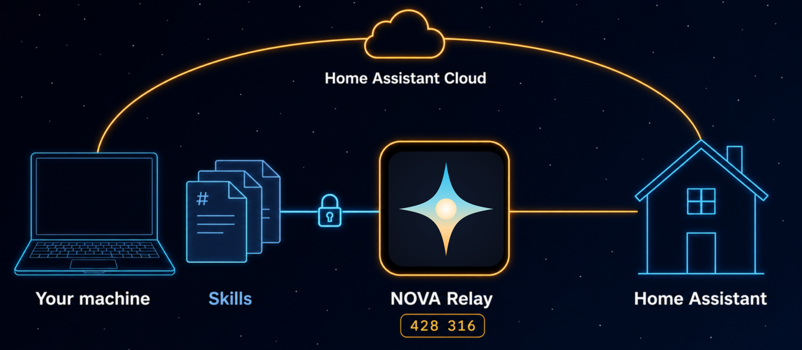
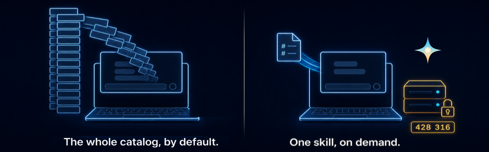

<p align="center">
  
</p>

<p align="center">
  <a href="https://github.com/markusleben/ha-nova/actions/workflows/ci.yml"></a>
  <a href="https://github.com/markusleben/ha-nova/blob/main/LICENSE"></a>
  
</p>

<p align="center">
  <b><a href="https://hanova.app/">hanova.app</a></b> · the 5-minute tour
</p>

<h2 align="center">One code to connect. Every change checked.</h2>

<p align="center">
  On HA OS or Supervised, pair your AI with one six-digit code from the NOVA page.<br>
  Every change is previewed and approved first, then verified by reading it back.
</p>

<p align="center">
  Works with <b>Claude Code</b> · <b>Claude Desktop</b> · <b>Codex CLI</b> · <b>OpenCode</b> · <b>Google Antigravity</b> · <b>Hermes Agent</b> (preview)
</p>

> *"When I get home, set my main lights to a warm welcome scene"* — one sentence in, a fully reviewed automation out, including suggestions you might not have thought of.

## ✦ Three steps, one code

1. **Run the installer** — one command; the wizard finds your Home Assistant and sets up the NOVA Relay App.
2. **Click "Connect a device"** — on the NOVA page in your Home Assistant sidebar (the wizard opens Home Assistant at the right spot for you).
3. **Type the six-digit code** — done. Your AI is paired.

<p align="center">
  
</p>

*The code is one-time and expires in minutes. Each device gets its own connection you can revoke anytime from NOVA.*

<p align="center">
  <b><a href="#-what-you-can-do">What it does</a></b> · <b><a href="#%EF%B8%8F-safe-by-design">Is it safe?</a></b> · <b><a href="#-get-started">Get started</a></b> · <b><a href="#optional-remote-access-with-home-assistant-cloud-beta">Cloud</a></b> · <b><a href="#%EF%B8%8F-how-it-works">How it works</a></b>
</p>

> **Actively developed.** Core workflows are proven end-to-end on macOS, Linux, and Windows — and the product is young enough that your feedback still shapes it. Back up your configs before letting AI touch anything. Hit a problem? [Open an issue](https://github.com/markusleben/ha-nova/issues).

---

## 💬 What You Can Do

Say what you want. HA NOVA figures out the rest.

| You say | What happens |
|:--------|:-------------|
| *"Check my automations for problems"* | Audits against 40+ rules — catches conflicts, dead triggers, and mistakes you'd never spot manually |
| *"Why didn't my motion light trigger last night?"* | Replays the actual trace and tells you exactly where it failed and why |
| *"Turn on the porch light at sunset and off at 11 PM"* | Builds, previews, and reviews the automation before it touches your config |
| *"What happened to my living room temperature overnight?"* | Pulls history and summarizes the timeline in plain language |
| *"Add a weather card to my main dashboard"* | Reads the dashboard, shows the change, writes only after you confirm |
| *"Move all kitchen devices to the Kitchen area"* | Reassigns entities and devices — shows what will change first |
| *"Turn off the upstairs lights"* | Turns them off, confirms the new state |
| *"Remind me in 20 minutes to check the oven"* | Creates a one-time reminder that disables itself after it fires |
| *"Show me all temperature sensors"* | Finds entities by name, room, area, or label |

> Automations and scripts get the full workflow today: preview, review, and a 40+ rule audit. Helpers, dashboards, and device control get preview-and-verify — deeper audits are rolling out with every release.

---

## 🛡️ Safe by Design

We built this because we didn't trust AI with our own config either.

**What happens when AI wants to change something:**

1. **Researches first.** Finds your devices, checks your setup, resolves entity names. No guessing.
2. **Shows you the change.** A clear before/after table of exactly what will change, before anything is written.
3. **You approve it.** Deletes require a specific confirmation code — not just "yes." A reviewed batch delete takes one code bound to the exact list of items.
4. **Captures a recovery point first.** Before a covered delete or full-configuration replacement, HA NOVA snapshots the item it is about to change — so "gone" has a way back.
5. **Writes and verifies.** Reads the config back to confirm the change stuck.
6. **Audits itself.** Checks for mistakes, conflicts, and reliability issues.
7. **Offers a safe test.** After saving a new or changed automation or script, you get a test plan matched to the risk — from a zero-impact logic check to a real run that names exactly which devices will switch before you say go.
8. **Offers a way back — three clearly separated layers.** Reply `revert` to undo the latest verified update. Restore a deleted automation, script, scene, dashboard, or storage helper from its config snapshot through the same preview-and-confirm flow — "restore the kitchen automation you deleted yesterday" works. For everything beyond that, a Home Assistant Backup. `revert` and config snapshots cover changes made **through HA NOVA** only — edits made directly in the Home Assistant UI, by other tools, or by hand in YAML are not captured, and a config snapshot restores the item itself, not every reference to it. Home Assistant Backups remain system-wide.

**The ground rules — always:**

- 🔒 **Relay credentials stay out of the AI.** The App's Home Assistant credential stays inside the Relay. Optional Cloud access uses a separate Home Assistant OAuth authorization in this computer's native credential store; neither credential is exposed to the AI.
- 🔑 **Every device is paired on its own.** The six-digit code is one-time and short-lived; what it creates is a per-device credential over an encrypted, pinned connection (OPAQUE, RFC 9807 + SPKI-pinned TLS 1.3 under the hood). (On App installs; the standalone container uses one shared token instead.)
- 🗑️ **Revoke with one click on App installs.** Lost a laptop? Retired a machine? Cut off that paired device from the NOVA page — everything else keeps working.
- 📖 **Every rule the AI follows is a markdown file you can read.**
- 🏠 **No HA NOVA-operated cloud relay or usage analytics.** Local mode stays between your machine and Home Assistant. Optional Cloud mode uses your Nabu Casa service; HA NOVA receives none of that traffic.
- 📊 **Census off by default.** Only after your explicit opt-in, the [Census](docs/reference/census.md) sends the payload schema, a dedicated random Census installation ID, HA NOVA version, operating system, and a recently observed Relay version when available. The ID lets repeat reports from the same participating installation count once; it is not a person count or the complete installed base. HA NOVA sends the first report immediately and another no sooner than seven days later. Cloudflare is the hosting provider and processes source-IP and connection metadata for HTTPS; HA NOVA ingest does not read or store the IP. Aggregate active/known version, OS, and Relay breakdowns stay in private maintainer statistics, with official Relay App totals shown separately. Turn it off anytime with `ha-nova census off`; see [the privacy details](PRIVACY.md).

---

## 🚀 Get Started

One installer. One wizard. One code. It even finds your Home Assistant automatically.

> **You need:** Home Assistant — any install type. HA OS and Supervised get the NOVA Relay App, and the wizard below walks you through it. Container and Core run the same relay as a [standalone container](docs/reference/relay-container.md) — same skills, same safety guarantees, with a token-based setup: skip the steps below and follow that guide end to end instead.

**macOS / Linux:**

```sh
curl -fsSL https://raw.githubusercontent.com/markusleben/ha-nova/main/install.sh | bash
```

**Windows (PowerShell):**

```powershell
irm https://raw.githubusercontent.com/markusleben/ha-nova/main/install.ps1 | iex
```

The installer selects the latest stable release. Run the command for your OS; the wizard discovers your Home Assistant, walks you through installing the NOVA Relay App, and configures your AI clients. At the pairing step it opens Home Assistant for you — open **NOVA** in the sidebar (or "Open Web UI" on the app page), click **"Connect a device"**, type the six-digit code, done.

### Optional remote access with Home Assistant Cloud (Beta)

The wizard keeps **Local only** as the recommended default. If you have a paid Home Assistant Cloud subscription from Nabu Casa with Remote UI enabled, choose **Local + Home Assistant Cloud** for automatic remote fallback or **Home Assistant Cloud only** for remote-first setup. The wizard validates your Cloud URL, opens Home Assistant OAuth, and stores the authorization in the native macOS, Windows, or Linux desktop credential store. HA NOVA runs no additional public tunnel or hosted broker.

Cloud Remote requires Home Assistant OS/Supervised and a supported desktop session for authorization; an interrupted, already-verified setup can finish over SSH with `ha-nova cloud add --remote-resume`. Headless, WSL, service, gateway, Container, and Core setups stay local-only. Remote-first pairing uses a separate private Owner session to create the one-time NOVA device code; the OAuth user can remain a standard Home Assistant user.

Already installed locally? Run `ha-nova cloud add`, or rerun `ha-nova setup` for the same guided choice.

<p align="center">
  
</p>

*Local stays first: the CLI prefers the direct connection and uses your Home Assistant Cloud remote access only as an automatic fallback — no manual URL switching.*

Once it finishes, try: *"Show me all my automations."*

> **More than one Home Assistant?** Add each further instance with `ha-nova pair --server <name> --relay-url http://<ha-host>:8791` — every server gets its own profile and its own isolated credential. Select one with the `--server <name>` flag on relay calls or the `HA_NOVA_SERVER` environment variable, and manage profiles with `ha-nova server list|default|rename|remove`.

> **Upgrading from an earlier HA NOVA?** Everything keeps working through the update. To move to per-device pairing, re-pair each computer once (one code each), then revoke the old shared access from the NOVA page whenever you're ready.

<details>
<summary><strong>Platform notes</strong></summary>

<br>

**macOS** — proven end-to-end on real hardware.

**Linux** — proven end-to-end, including headless setups (servers, containers, LXC, SSH): with no desktop keyring around, the device credential falls back to a private file automatically.

**Windows** — proven end-to-end on a live Windows 11 system. Ships x64 builds (Windows ARM64 can use the x64 build through emulation; no native ARM64 bundle is shipped).
- Claude Code is the most tested client on Windows today
- Google Antigravity has basic validation
- Codex and OpenCode are still early
- Native prerequisites: Claude Code needs Git for Windows / Git Bash; Google Antigravity Desktop or CLI must be installed
- See [.claude/INSTALL.md](.claude/INSTALL.md) and [.antigravity/INSTALL.md](.antigravity/INSTALL.md)

> Do not download the `ha-nova-installer-bundle-*.tar.gz` / `.zip` assets manually. Those archives are used by the installer behind the scenes. Always use the one-liner or `ha-nova update`.

</details>

<details>
<summary><strong>CLI commands & legacy uninstall</strong></summary>

<br>

| Command | What it does |
|:--------|:-------------|
| `ha-nova check-update` | Check for newer versions |
| `ha-nova update` | Update to the latest release |
| `ha-nova setup` | Re-run the setup wizard |
| `ha-nova pair` | Pair this computer again with a fresh six-digit code |
| `ha-nova doctor` | Diagnose connection and config problems |
| `ha-nova uninstall` | Remove HA NOVA (keeps settings for easy reinstall) |
| `ha-nova uninstall --purge` | Remove runtime, settings, and credentials; retain one opaque local marker that blocks stale processes from restarting census activity |

**Coming from a pre-Go install?**
- macOS / Linux: `curl -fsSL https://raw.githubusercontent.com/markusleben/ha-nova/main/scripts/legacy-uninstall.sh | bash`
- Windows: `irm https://raw.githubusercontent.com/markusleben/ha-nova/main/scripts/legacy-uninstall.ps1 | iex`

</details>

> **Not a terminal person?** Setup is one copy-pasted command; after that, Claude Desktop and Google Antigravity Desktop give you the same skills in an app window — and pairing another computer is just one more six-digit code.

---

## ⚙️ How It Works

<p align="center">
  
</p>

**Skills** live on your machine as plain markdown. They're the AI's playbook — what to check, what to show you first, what to verify after a change. You can open them, read them, even edit them.

**The Relay** lives on your Home Assistant server. On the local path it is the only part that talks to Home Assistant directly, and its upstream credential stays inside it. Optional Cloud mode lets the CLI establish the Nabu Casa connection with OAuth authorization from native desktop secure storage; neither credential enters a prompt. Each paired device still reaches the Relay with its own encrypted credential, and the NOVA page is where you connect or revoke devices.

Most new HA NOVA workflows are text-file skill updates on your machine. The Relay only changes when a workflow needs something genuinely new from Home Assistant — and even then it stays the dumb pipe: all the know-how stays in the skills.

And because the Relay sits right next to Home Assistant, it can do things a remote client can't — like snapshotting an automation before it updates it, so you can revert the latest verified update with a single word. Deletes of snapshot-covered config items — automations, scripts, scenes, dashboards, and most helpers — capture a config snapshot first, so they can be restored through the same preview-and-confirm flow; paths without a snapshot fall back to a suitable Home Assistant Backup.

Every safety guarantee above is backed by a file and a test — the **[safety page](docs/reference/safety.md)** maps each claim to what enforces and verifies it.

---

## ⚖️ Why not an MCP server?

Fair question — we built one first. 88,000 lines of it, never shipped. What it taught us is exactly what HA NOVA does differently:

<p align="center">
  
</p>

| | Tool-based MCP server | ✦ HA NOVA |
|:--|:--|:--|
| 📖 **Where the know-how lives** | In server code — changing the behavior means changing the server | In markdown files you can open, read, and edit yourself |
| 🛡️ **Safety model** | Configurable: read-only modes, per-tool toggles, approval policies you set up | Enforced for every change: preview first, deletes take a typed code, every write is verified — each guarantee backed by a test |
| 🏠 **Where it runs** | The leading project's recommended setup runs inside Home Assistant's own process | A deliberately dumb relay in its own process — a crash can't touch Home Assistant, and it holds no HA business logic |
| 🔑 **Connecting a device** | A shared secret (URL or token) — or OAuth where configured | A one-time six-digit code per device, each individually revocable from the NOVA page *(App installs; the standalone container keeps a server-side token)* |

> **The honest bit:** the MCP side is ahead on breadth today — more tools (App management, dashboard screenshots, ZHA inspection), more contributors, more stars. It's the older project. But the asymmetry matters: **our gaps close one markdown file at a time — turning a tool server's Python into plain text you can read would be a rewrite.**

Full detail, named, dated, honest in both directions: **[comparison page](docs/reference/comparison.md)**.

---

## 🧩 Skills

30 task skills plus the HA NOVA context skill — each one a markdown file you can read and edit.

- ✏️ **Build & change** — automations & scripts, helpers, scenes, dashboards, areas & labels, device control, YAML-only config
- 🔍 **Understand & debug** — config reading, 40+ rule audits, root-cause tracing, history & stats, entity discovery, system health
- 🧰 **Run & maintain** — backups, updates, HACS packages, recorder & statistics repair, energy, MQTT, InfluxDB history, integration setup
- 🏠 **Everyday** — media & speakers, notifications, cameras, voice assistants, to-dos, calendars
- 🛟 **Admin & safety net** — persons, zones & users (owner-guarded), blueprint fallback, onboarding & troubleshooting

<details>
<summary><strong>The full list — all 30 skills</strong></summary>

<br>

| Skill | What it does |
|:------|:-------------|
| ✏️ **write** | Build and change automations with full preview and safety checks |
| 📖 **read** | Inspect your automation and script configs as they really are |
| 🔍 **review** | Audit your setup for mistakes, conflicts, and reliability gaps |
| 🧱 **dashboard** | Edit dashboards, cards, and Lovelace resources safely |
| 🎬 **scene** | Create and manage scenes, including "save this room as a scene" |
| 🗂️ **organize** | Manage areas, floors, labels, and entity metadata |
| 🕒 **history** | Query history, logbook timelines, and long-term stats |
| 🏠 **health** | Summarize Home Assistant status, repairs, integrations, system health, and noisy entities |
| 📅 **calendar** | Read calendars and bounded event windows |
| ✅ **todo** | Manage to-do and shopping-list items, create Local To-do lists |
| 💾 **backup** | Check backup status, create backups — also as a safety net before risky changes |
| ⬆️ **updates** | See pending updates, read release notes, and install them with safety gates |
| 📦 **hacs** | Browse, install, pin, update, and remove HACS packages — with previews and a mandatory backup before destructive migrations |
| ⚡ **energy** | Analyze consumption, solar, battery, and per-device costs; manage Energy dashboard sources |
| 🧹 **maintenance** | Repair statistics, purge recorder history, and clean up dead entities — with strict safety gates |
| 🎛️ **service-call** | Control lights, climate, covers, switches, and media players |
| 🔎 **entity-discovery** | Find entities by name, room, area, or label |
| 🧩 **helper** | Create and manage helpers: counters, timers, template sensors, and more |
| 🩺 **diagnose** | Root-cause a concrete failure: "why didn't my automation run?" |
| 🎵 **media** | Control media players, browse libraries, group speakers, send TTS announcements |
| 📣 **notify** | Send notifications to your phone, manage persistent notifications |
| 📷 **camera** | Look at the current camera frame, get stream URLs, record |
| 📡 **mqtt** | Listen to MQTT topics, inspect discovery, publish with guards |
| 🗣️ **assist** | Test what your voice assistant understands, manage pipelines and voice exposure |
| 👥 **admin** | Manage persons, zones, tags, and user accounts — with hard owner guards |
| 🔌 **integration-setup** | Add new integrations and finish reauthentication flows |
| 📝 **yaml-config** | Edit YAML-only configuration (template/REST/command-line sensors, packages, themes) via opt-in file access |
| 📊 **external-sources** | Query InfluxDB directly for history the recorder purged long ago |
| 🛡️ **fallback** | Safety net for blueprints and advanced ops |
| 🚀 **onboarding** | Diagnose setup issues and troubleshoot connections |

</details>

Want to add a new capability? → [CONTRIBUTING.md](CONTRIBUTING.md)

The skills declare the NOVA Relay version they need (see `version.json`) and warn at runtime when the installed relay app is older — update it in Home Assistant under **Settings > Apps > NOVA Relay**.

---

## 🖥️ Supported Clients

| Client | Type |
|:-------|:-----|
| [Claude Code](https://github.com/anthropics/claude-code) | Terminal |
| [Claude Desktop](https://claude.com/download) (Code tab) | Desktop app |
| [Codex CLI](https://github.com/openai/codex) | Terminal |
| [OpenCode](https://github.com/opencode-ai/opencode) | Terminal |
| [Google Antigravity](https://antigravity.google/) | Desktop app / Terminal |
| Hermes Agent (preview) | Terminal |

> Google Antigravity is the current Google client path. `ha-nova setup gemini` remains a legacy alias for existing Gemini-era installs.

> **Hermes is in preview.** The Linux desktop route (GNOME Keyring) is maintainer-validated; macOS and Windows-via-WSL2 are experimental, and native Windows isn't supported. Details: [.hermes/INSTALL.md](.hermes/INSTALL.md).

---

## 🔮 What's Next

HA NOVA is young — and that's the point. Here's where it's going:

- **Deeper reviews everywhere** — the full 40+ rule audit, expanding beyond automations
- **Community skills** — write a new workflow as a markdown file, share it with everyone
- **A guided Docker path in the wizard** — Container and Core setup without the manual steps

> If you've ever wanted to shape how AI works with Home Assistant, this is the stage where your input actually changes the product.

---

## 🤝 Contributing

This is the best time to get involved.

- **Write a skill** — add a new workflow in markdown, no server code needed
- **Test on your setup** — edge cases from real installs make everything better
- **Improve docs** — make HA NOVA clearer for the next person
- **Tackle an [open issue](https://github.com/markusleben/ha-nova/issues)** — especially if you want a workflow to become first-class

→ [CONTRIBUTING.md](CONTRIBUTING.md)

---

## 📖 The Story

I spent over a year building an 88K-line MCP server for Home Assistant. Kept adding features, never releasing. Others shipped theirs while mine sat on my machine.

Then I realized the architecture was the problem. Instead of burying HA knowledge in a huge server, I could keep the server lean and write the workflows as plain text — readable, editable, and much easier to grow with other people.

HA NOVA is what came out of that. **[Here's an early demo](https://youtu.be/ylak867RkzM)** from the MCP era.

---

## 📄 License

[MIT](LICENSE)

## 🙏 Acknowledgments

Safety-rule ideas inspired by [HALMark](https://github.com/nathan-curtis/HALMark) by Nathan Curtis. Automation patterns, helper guidance, and device-control patterns adapted from [homeassistant-ai/skills](https://github.com/homeassistant-ai/skills) by Sergey Kadentsev ([@sergeykad](https://github.com/sergeykad)) and Julien Lapointe ([@julienld](https://github.com/julienld)).
